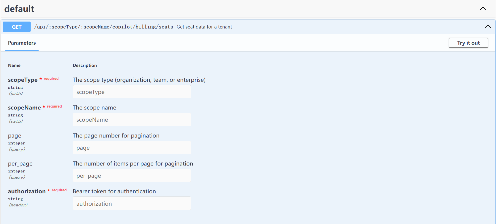
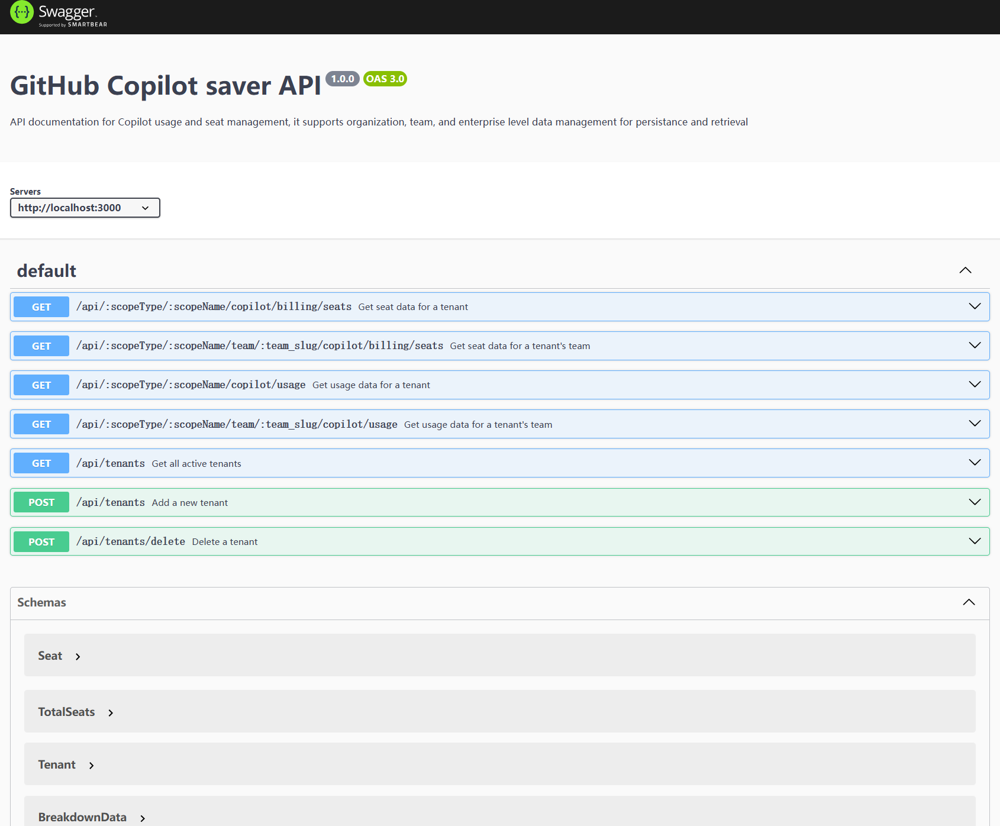

# Copilot Saver App
# Based on GitHub Copilot Usage and Seat API,provide persistent save and multi-tenant features.

Since GitHubCopilot usage and seat API (see https://docs.github.com/en/rest/copilot/copilot-usage?apiVersion=2022-11-28) just return latest information. like copilot usage only returns latest 28 days usage. and manager API just return the current-latest activity. if we need a long period usage and seat for analysis. it needs a job to periodllyget such data and save it for persistent. so this project is target to meet such requirement.

 This App works as backend, it will call GitHubAPI periodlly(each 12 hours by default), then  save the fetched data to a file or MySQL for persistent storage, and expose some data by RestAPI, just as similar with GitHubCopilot API itself, the path is same, just update the endpoint by replacing https://api.github.com/ with http://YourServer:3000/api/ 

 ## New Features


### Support for GitHub Copilot Metrics （2024/11/15）
add docker support.

### Support for GitHub Copilot Metrics （2024/11/12）

We have recently added support for GitHub Copilot Metrics. Here are some key features:

- **Metrics Data Persistence**: Support for persisting Copilot Metrics data to a database, ensuring reliable storage and management of data.
- **Multi-Tenant Support**: Support for multi-tenant architecture, allowing different organizations, teams, or enterprises to independently manage and access their Copilot Metrics data.
- **API Endpoint**: Added the `/api/:scopeType/:scopeName/copilot/metrics` endpoint to retrieve Copilot Metrics data for a specific tenant.
- **Swagger Documentation**: Enhanced Swagger documentation with descriptions for the `/api/:scopeType/:scopeName/copilot/metrics` endpoint, making it easier for developers to view and test the API.

## Features

- Fetch GitHub Copilot usage/metrics and seat data.
- Save data to files or MySQL database.
- Analyze the saved data and expose them through RestAPI ( http://YourServer:3000/api/organization/[organizationName]/copilot/usage or  http://YourServer:3000/api/enterprise/[EnterpriseName]/copilot/ ))
- Manage tenant information with support for organizations, teams, and enterprises.
- Securely handle tenant tokens and only return active tenants.
- call the GitHubAPI periodllyby default, it is each 12 hours.
- expose API description by swagger, it is http://yourserver/api-docs. so that the user can test the APIs there.

## Known issues
- For Team support in copilot user managment, since from GitHubbackend side, it only returns 'assigning_team' , not the team the user currently is in. and it needs the seat for users are assigned at team level, not individual level. we filter the team by 'assigning_team' field.
- Currently, there is a job in server.ts, it is fixed by below code. will set it as a parameter in future
 // Run job every 12 hours
setInterval(runJob, 12 * 60 * 60 * 1000);
- for Mysql support, it use non-TSL right now. will add TSL in future.
- when Trying 'try it out' in http://server:3000/api-docs, , for path parmeter, it didn't replace it well, so it will fail. and it works in PostMan or call it directly. it curls curl -X 'GET' \
  'http://localhost:3000/api/:scopeType/:scopeName/copilot/billing/seats' \
  -H 'accept: application/json'. and didn't replace the 'parameter'


## Installation

1. Clone the repository:
    ```sh
    git clone https://github.com/DevOps-zhuang/copilot-metric-saver.git
    cd copilot-metric-saver
    ```

2. Install dependencies:
    ```sh
    npm install
    npm install -g ts-node typescript

    ```

3. Configure the database and other settings in `.env`.
if you prefer to save the output as file format, no needed to update the database setting.

## Usage

### Running the Server on machine

Start the server:
```sh
ts-node src/server.ts
```

The server will run on `http://localhost:3000`.
And for the overroll API, plese visit `http://localhost:3000/api-docs`.


### Running the Server in Docker

docker build -t copilot-metrics-saver .
docker run -p 3000:3000 --env-file ./.env copilot-metrics-saver

### API Endpoints

#### Fetch and Save Usage Data

```http
GET /api/:scopeType/:scopeName/copilot/usage
```

**Parameters:**
- `scopeType`: The type of scope (organization, team, or enterprise).
- `scopeName`: The name of the scope.
- `token`: The authorization token (passed as a Bearer token in the Authorization header).
- `since` (optional): The start date for fetching usage data.
- `until` (optional): The end date for fetching usage data.
- `page` (optional): The page number for pagination.
- `per_page` (optional): The number of items per page for pagination.

**Example:**
```sh
curl -H "Authorization: Bearer YOUR_TOKEN" "http://localhost:3000/api/organization/example-org/copilot/usage"
```

#### Get Active Tenants

```http
GET /tenants
```

**Returns:** A list of active tenants with their `scopeType` and `scopeName`.

**Example:**
```sh
curl "http://localhost:3000/tenants"
```


## Project Structure

```
src/
├── api/
│   ├── GitHubApi.ts          # Contains functions to call GitHubAPIs.
│   ├── TenantServiceFactory.ts # Factory to create tenant service instances.
│   ├── UsageServiceFactory.ts  # Factory to create usage service instances.
│   ├── MySQLTenantStorage.ts   # Implementation of tenant storage using MySQL.
│   └── FileTenantStorage.ts    # Implementation of tenant storage using the file system.
├── model/
│   ├── Tenant.ts             # Tenant model class.
│   └── Metrics.ts            # Metrics model class.
└── server.ts                 # Main server file.
```

## Tenant Model

The `Tenant` class represents a tenant and includes the following properties:

- `scopeType`: The type of scope (organization, team, or enterprise).
- `scopeName`: The name of the scope.
- `token`: The authorization token.
- `isActive`: Indicates whether the tenant is active.

The `Tenant` class also includes a method to validate the tenant using the GitHubAPI.

## License

This project is licensed under the MIT License. See the LICENSE file for details.